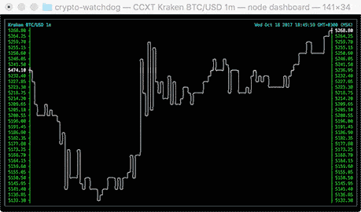

# NexaJS Market

### Access to ALL of Nexa's exchange partners in one place.

The `Market` package is used to connect and trade with cryptocurrency exchanges and payment processing services worldwide. It provides quick access to market data for storage, analysis, visualization, indicator development, algorithmic trading, strategy backtesting, bot programming, and related software engineering.



It is intended to be used by coders, developers, technically-skilled traders, data-scientists and financial analysts for building trading algorithms.

__Current feature list:__

- support for many cryptocurrency exchanges — more coming soon
- fully implemented public and private APIs
- optional normalized data for cross-exchange analytics and arbitrage
- an out of the box unified API that is extremely easy to integrate
- works in Node 10.4+, Python 3, PHP 8.1+, netstandard2.0/2.1 and web browsers

### Supported Exchanges

1. [Binance](https://accounts.binance.com/en/register?ref=D7YA7CLY)
2. [BitMart](http://www.bitmart.com/?r=rQCFLh)
3. [CoinEx](https://coinex.com)
4. [Kraken](https://www.kraken.com/)
5. [KuCoin](https://www.kucoin.com/ucenter/signup?rcode=E5wkqe)
6. [MEXC Global](https://m.mexc.com/auth/signup?inviteCode=1FQ1G)
7. [Txbit](https://txbit.io)


## Documentation

Read the [Manual](https;//nexajs.org/market) for more details.

## Usage

### Intro

The CCXT library consists of a public part and a private part. Anyone can use the public part immediately after installation. Public APIs provide unrestricted access to public information for all exchange markets without the need to register a user account or have an API key.

__Public APIs include the following:__

- market data
- instruments/trading pairs
- price feeds (exchange rates)
- order books
- trade history
- tickers
- OHLC(V) for charting
- other public endpoints

In order to trade with private APIs you need to obtain API keys from an exchange's website. It usually means signing up to the exchange and creating API keys for your account. Some exchanges require personal info or identification. Sometimes verification may be necessary as well. In this case you will need to register yourself, this library will not create accounts or API keys for you. Some exchanges expose API endpoints for registering an account, but most exchanges don't. You will have to sign up and create API keys on their websites.

__Private APIs allow the following:__

- manage personal account info
- query account balances
- trade by making market and limit orders
- deposit and withdraw fiat and crypto funds
- query personal orders
- get ledger history
- transfer funds between accounts
- use merchant services

### Initializing

> Authentication credentials are (optional), but are _required_ for private API (data) endpoints.

```js
import { Market, version } from '@nexajs/market'

const mexc = new Market.mexc({
    apiKey: 'YOUR_PUBLIC_API_KEY',
    secret: 'YOUR_SECRET_PRIVATE_KEY',
})

console.log(version)
// 23.7.21
```

### Fetch Ticker

```js
import { mexc } from '@nexajs/market'

const exchange = new mexc()

const ticker = await exchange.getTicker('NEXA/USDT')
console.log(ticker)
/*
{
 ...
}
*/
```

### Make Trade

```js
import { coinex } from '@nexajs/market'

const exchange = new coinex()

const orderParams = {
    pair: 'NEXA/USDT',
}

const orderDetails = await exchange.createOrder(orderParams)
console.log(orderDetails)
/*
{
 orderId: ...,
}
*/
```
